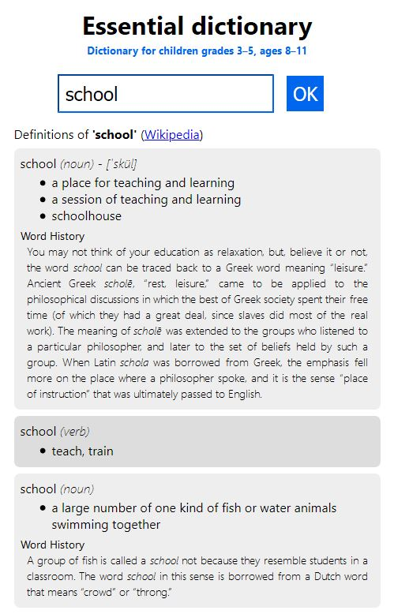

# Essential dictionary

The goal of this project is to provide a small search UI for the [Merriam-Webster's elementary dictionary](https://www.dictionaryapi.com/products/api-elementary-dictionary).

_Example of the Essential dictionary UI:_  


## Warning

This project is not ready for deployment! The main reason is that the call to the Merriam-Webster API is done from the front-end making the api key accessible. Obviously some improvement are necessary.

## Setup

### 1. Get an api key

[Register to the api](https://www.dictionaryapi.com/register/index) and paste your key in a file named _'.env.local'_ at the project's root.

```
REACT_APP_MERRIAM_WEBSTER_API_KEY=xxxxxxxx-xxxx-xxxx-xxxx-xxxxxxxxxxx
```

### 2. Install packages

run this command to install the npm packages (from the root directory)

```
npm i
```

### 3. Run the project

run

```
npm start
```

Navigate to the url: http://localhost:3000
